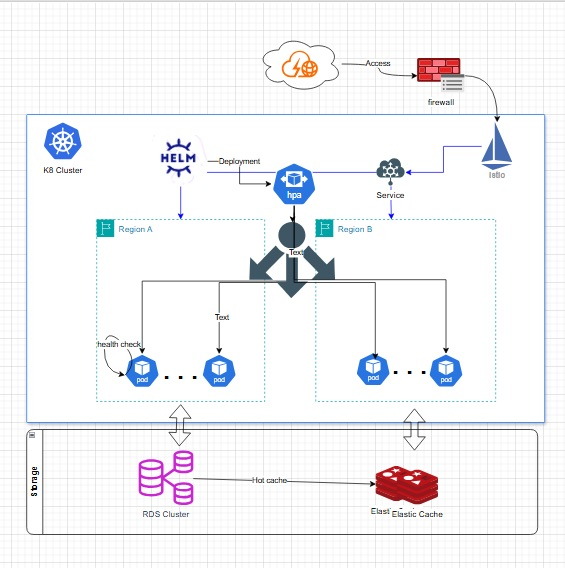

# real-time-balance-calculation
A high-performance, resilient Java-based financial transaction processing system deployed on Kubernetes.

## Architecture Design
### Tech architecture

### API Design

### Deployment architecture


---
## Building
build image with maven and docker

##### Building JAR package.
```bash
mvn clean package -DskipTests
```
#### Build Docker images

```bash
docker build -t repo/real-time-balance-calculation:latest .
docker build -t repo/real-time-balance-calculation:1.0.0 .
```

---
## Testing 
#### Unit Testing
Unit testing with JUnit5 and Jacoco, the report file in the directory `target/site/jacoco`
```bash
mvn test jacoco:report
```
[Unit Testing Report](target/site/jacoco/index.html)

---
## Deployment 
1. 
### On Perm
Install containers with docker-compose/podman-compose

Will start up DB¡¢cache and the application
Local testing, for testing use

#### start up containers
```bash
bash deployment/compose/start.sh
```
#### down containers
```bash
bash deployment/compose/stop.sh
```

### On K8 Cluster
K8s deployment By Helm chart

#### Key points
- [ ] Liveness Probe and readiness probe with `actuator/health`
- [ ] PodAntiAffinity topology to multiple zone for high availability
- [ ] HAP Probe cpu usage > 80%
- [ ] Terminate gracefully with k8 Rolling update and SpringBoot shutdown

#### Deploy to K8s cluster
```bash
bash deployment/k8s/install.sh
```

#### UnDeploy helm chart
```bash
bash deployment/k8s/uninstall.sh
```

